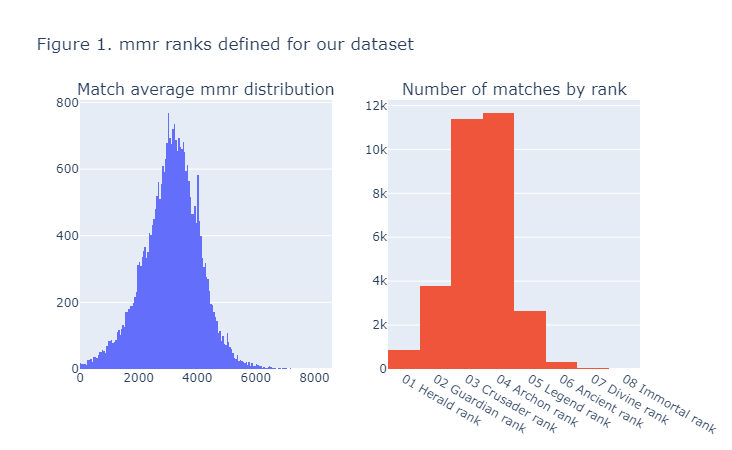
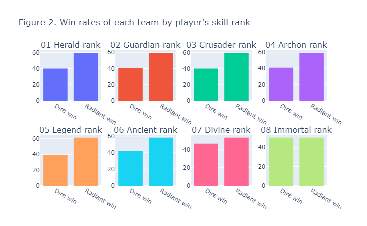
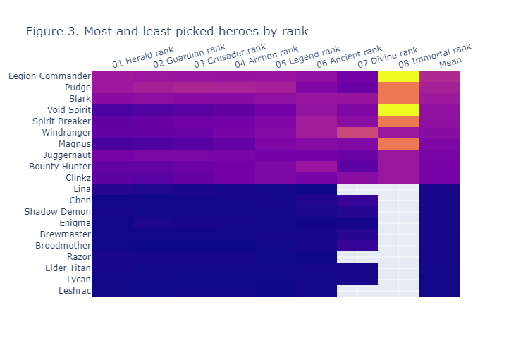
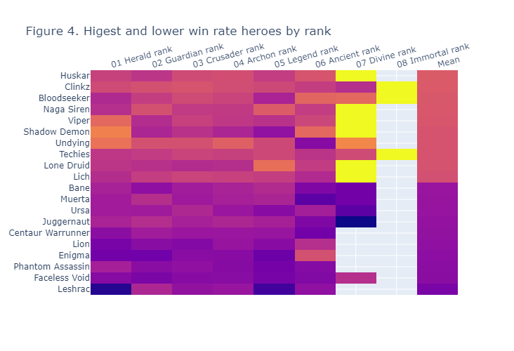
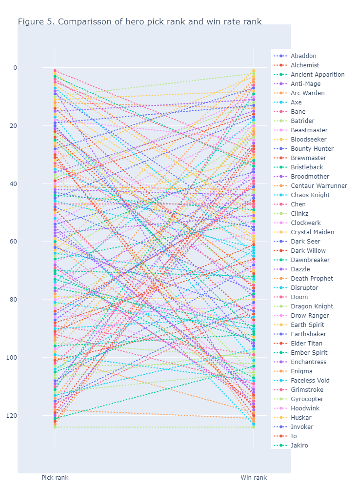
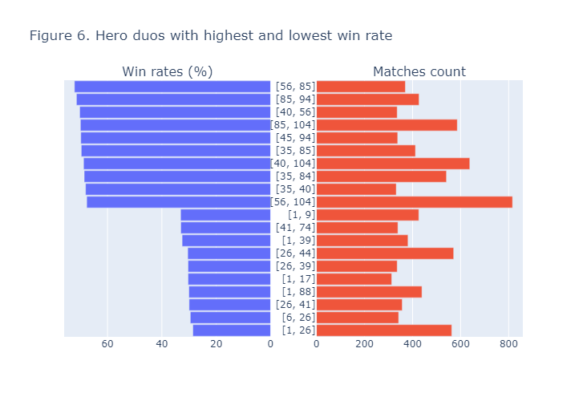
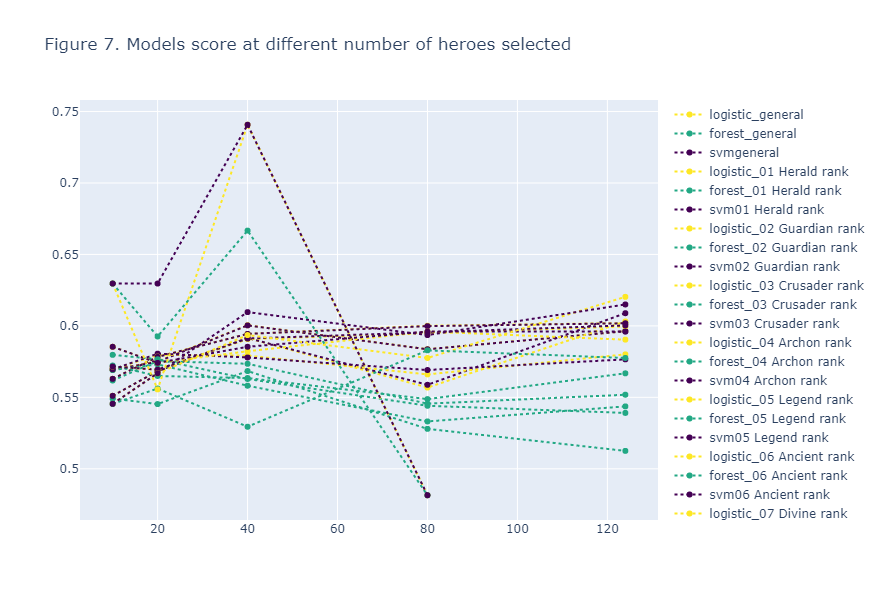

# Exploratory Analysis of Dota 2: Impact of Team Compositions and Player Ranks on Match Outcomes (beta)

Guzman-Diaz S., 2023

## INTRODUCTION


Multiplayer Online Battle Arena (MOBA) games have risen in popularity over the years, becoming a significant part of the competitive eSports landscape. MOBAs are a subgenre of strategy video games in which teams of players compete against each other on a predefined battlefield<sup>[1](https://en.wikipedia.org/wiki/Multiplayer_online_battle_arena)</sup>. MOBA games have risen in popularity over the years, becoming a significant part of the competitive eSports landscape. 

One of the most renowned and widely played MOBAs is Dota 2. Developed by Valve Corporation, Dota 2 has captured the attention of millions of players worldwide with approximately 700,000 daily players<sup>[2](https://store.steampowered.com/charts/mostplayed)</sup>. Dota 2 matches consist of two teams, Radiant and Dire, each comprising five players. Each team occupy and defend their own separate base on the map. For this, the players  control powerful characters called "heroes," each possessing unique abilities and play styles. <sup>[3](https://en.wikipedia.org/wiki/Dota_2)</sup>. 

Success in a Dota 2 requires effective team communication, skilled players (quantified by their MMR), and a well-balanced combination of heroes in the team's draft. With a total of 124 different heroes, it is widely recognized that certain heroes exhibit higher win rates than others, particularly at specific skill levels<sup>[4](https://www.dotabuff.com/heroes/meta)</sup>. However, the individual hero win rate alone cannot determine the outcome of a match.

Analyzing games, such as Dota 2, provides valuable insights into the dynamics of team play, individual skill, and hero selection strategies. Exploring the data behind matches can uncover patterns, trends, and factors that contribute to successful gameplay and impact match outcomes. These insights can inform game developers, professional teams, and players, helping them refine strategies, balance gameplay mechanics, and make informed decisions.

This exploratory analysis aims to identify the impact of team compositions and player rank on the outcome of Dota 2 matches. Data from over 40,000 matches was collected and subjected to statistical analysis. The dataset was divided by skill bracket, and factors that can predict match outcomes were identified.

## Methods

For this analysis, match data was collected through May 2023 using the OpenDota API<sup>[5](https://www.opendota.com/api-keys)</sup> wThe data collection process utilized the script data_collector.py, available in this repository. Match data was iteratively obtained from the API and stored in an SQLite database for subsequent use. All collected data corresponds to game version 7.33c. Additionally, hero data and individual match data were obtained from the same API and combined with the match data. Data was analyzed for both team (Dire or Radiant) and in a combined manner.

Eight ranks were defined based on the average player MMR of the matches. Data was analyzed for each of these skill brackets. The relationship between the heroes selected by a team and their probabilities of winning was observed. Data from duos (pairs of heroes within a team) and trios (groups of three heroes) was analyzed to identify combined effects.
Finally, the match data was used to train a model for predicting match outcomes based on the hero combinations selected by teams. Three different algorithms were tested: Logistic Regression (LR), Random Forest (RF), and Linear SVC (SVC). A general model was developed for the complete dataset, along with a series of submodels for each rank. Due to time constraints, the random forest algorithm was only used with the ranks dataset. The number of heroes included in the model was reduced based on the results of Recursive Feature Elimination (RFE) using a LR estimator, and significance was estimated using a Generalized Linear Model. Different numbers of heroes were tested to identify the best model. The dataset was divided into training and test datasets, and the score of each dataset (as reported by sklearn.score) was used as an indicator of each model's performance.


```python
### import modules and data
from copy import deepcopy
from joblib import dump, load
import json
import pandas as pd
from plotly.subplots import make_subplots
import plotly.graph_objects as go
import plotly.express as px 


from utils.dota_data_utils import DotaData 
import utils.dota_plots_utils as dota_plots_utils 
from utils.dota_analytics_utils import DotaPredictionModels

args = json.load(open('dota_data_config.json'))
data = DotaData(**args['dota_data'])
```

## Results and Discussion

### General Results

Data from a total of 46,802 matches was collected. Matches corresponding to game_mode = 1 ('All pick') and game_mode = 22 ('Ranked all pick') were extracted, while matches with missing values (NA) were removed, resulting in a total of 30,721 remaining matches.


```python
### Table 1. Match data collected
data.match_data = data.match_data.loc[data.match_data['game_mode'].isin([1, 22])]
data.match_data.dropna(inplace=True)
# print(data.match_data['avg_mmr'].median())
print('Table 1. Match data collected')
print(data.match_data[['radiant_win', 'duration', 'avg_mmr', 'game_mode', 'dota rank']].describe())
```
Table 1. Match data collected
|       | radiant_win | duration |   avg_mmr   | game_mode |
| ----  | ----------- | -------- | ----------- | --------- |
| count |    30721 |       30721 |       30721 |     30721 |
| mean  | 0.595912 | 1714.628463 | 3127.390742 | 21.998633 |
| std   | 0.490723 |  272.337344 |  977.207525 |  0.169438 |
| min   | 0.000000 |  366.000000 |    1.000000 |  1.000000 |
| 25%   | 0.000000 | 1569.000000 | 2539.000000 | 22.000000 |
| 50%   | 1.000000 | 1736.000000 | 3172.000000 | 22.000000 |
| 75%   | 1.000000 | 1900.000000 | 3755.000000 | 22.000000 |
| max   | 1.000000 | 2509.000000 | 8576.000000 | 22.000000 |

### MMR Ranks

The MMR of the matches ranged from 1 to 8,576, with a mean of 3,130 and a median of 3,172. Based on these results, eight MMR ranks were defined.


```python
### Figure 1. mmr ranks defined for our dataset
ranks_size = round(data.match_data['avg_mmr'].dropna().max()/8)

### split data in ranks
# for n, rank_n in enumerate(data.dota_ranks.keys()):  
#     if n == 0:
#         low_range = round(n*ranks_size)
#     else:
#         low_range = high_range + 1
#     high_range = low_range + ranks_size
#     # print(f'{rank_n} range: {low_range} - {high_range}')

fig_1 = make_subplots(rows=1, cols=2, subplot_titles=("Match average mmr distribution",
                                                    "Number of matches by rank"))
fig_1.add_trace(go.Histogram(x=data.match_data['avg_mmr'].dropna()), row=1, col=1)
fig_1.add_trace(go.Histogram(x=data.match_data['dota rank'].dropna().sort_values()), row=1, col=2)
fig_1.update_layout(showlegend=False, title_text="Figure 1. mmr ranks defined for our dataset")
fig_1.show()
```


Analyzing the data by rank, a higher win rate for the Radiant team was observed across all skill brackets. While the Dota 2 map is considered balanced, there have been discussions about the Radiant base being more comfortable to play for most players, which could explain this disparity<sup>[6](https://www.reddit.com/r/DotA2/comments/133ub5r/radiant_wins_more_than_dire_in_berlin_major/)</sup>.


```python
### Fig 2. Win rates of each team by player's skill rank
fig_2 = make_subplots(rows=2, cols=4, subplot_titles=list(data.dota_ranks.keys()))
pos = {0:[1,1], 1:[1,2], 2:[1,3], 3:[1,4], 
       4:[2,1], 5:[2,2], 6:[2,3], 7:[2,4]}

for n, rank in enumerate(data.dota_ranks.keys()):
    fig_2.add_trace(go.Histogram(x=data.match_data.loc[data.match_data['dota rank'] == rank,
                                                     'radiant_win'] \
                               .sort_values() \
                               .replace(1, 'Radiant win') \
                               .replace(0, 'Dire win'), 
                               histnorm='percent'),
                  row=pos[n][0], col=pos[n][1])
fig_2.update_layout(showlegend=False,
                  title_text="Figure 2. Win rates of each team by player's skill rank")
fig_2.show()
```


### Heroe Individual Pick and Win Rate

When examining hero data, certain heroes exhibit higher pick rates across all skill ranks, while others are rarely used in higher brackets. For example, Legion Commander was the most frequently selected hero, present in 30% of all drafts and 75% of Immortal Rank matches. On the other hand, Leshrac was used in only 1.2% of games and did not appear in the 7th and 8th ranks.


```python
###Figure 3. Most and least picked heroes by rank
heroes_pick_df = data.heroes_pick_df('both')
heroes_pick_df.set_index('localized_name', inplace=True)
heroes_pick_df['Mean'] = heroes_pick_df.mean(axis=1)
heroes_pick_df.sort_values(by='Mean', inplace=True)
pick_rank = heroes_pick_df.copy().sort_values(by='Mean', ascending=False)
heroes_pick_df = pd.concat([heroes_pick_df.head(10), heroes_pick_df.tail(10)])

fig_3 = go.Figure(data=go.Heatmap(x=heroes_pick_df.columns,
                                y=list(heroes_pick_df.index),
                                z=heroes_pick_df))
fig_3.update_traces(showscale=False)
fig_3.layout.height = 500
fig_3.update_xaxes(side='top', tickangle=-15)
fig_3.update_layout(title_text="Figure 3. Most and least picked heroes by rank")
fig_3.show()
```


Hero win rates also varied by rank. Huskar, Clinkz, Bloodseeker, and Naga Siren demonstrated win rates higher than 62%, while heroes such as Enigma, Phantom Assassin, Faceless Void, and Leshrac had win rates below 40%.


```python
### Figure 4. Higest and lower win rate heroes by rank
heroes_wlr_df = data.heroes_wlr_by_rank()
heroes_wlr_df.set_index('localized_name', inplace=True)
heroes_wlr_df['Mean'] = heroes_wlr_df.mean(axis=1)
heroes_wlr_df.sort_values(by='Mean', inplace=True)
wlr_rank = heroes_wlr_df.copy().sort_values(by='Mean', ascending=False)
heroes_wlr_df = pd.concat([heroes_wlr_df.head(10), heroes_wlr_df.tail(10)])

fig_4 = go.Figure(data=go.Heatmap(x=heroes_wlr_df.columns,
                                y=list(heroes_wlr_df.index),
                                z=heroes_wlr_df))
fig_4.update_traces(showscale=False)
fig_4.layout.height = 500
fig_4.update_xaxes(side='top', tickangle=-15)
fig_4.update_layout(title_text="Figure 4. Higest and lower win rate heroes by rank")
fig_4.show()
```


The data reveals that popular heroes like Clinkz and Techies, which are frequently picked, also have high win rates. Conversely, Leshrac, the most overlooked hero, demonstrates a corresponding low win rate.

Furthermore, it is worth noting that the most picked heroes are not necessarily the ones with the highest win rates. For instance, Juggernaut is the eighth most selected hero but has one of the lowest average win rates. Conversely, heroes like Lone Druid, Naga Siren, Shadow Demon, and Viper, despite not being among the most frequently selected, have some of the highest win rates.


```python
###Figure 5. Comparisson of hero pick rank and win rate rank
pick_rank.drop(list(data.dota_ranks.keys()), axis=1, inplace=True)
pick_rank.drop('Mean', axis=1, inplace=True)
for n, hero in enumerate(pick_rank.index):
    pick_rank.at[hero, 'Pick rank'] = n + 1

wlr_rank.drop(list(data.dota_ranks.keys()), axis=1, inplace=True)
wlr_rank.drop('Mean', axis=1, inplace=True)
for n, hero in enumerate(wlr_rank.index):
    wlr_rank.at[hero, 'Win rank'] = n + 1
    
combined_rank = pick_rank.merge(wlr_rank, how='left', on='localized_name')
combined_rank.sort_values(by='localized_name', inplace=True)
combined_rank = combined_rank.transpose()

fig_5 = go.Figure()
for hero in combined_rank.columns:
    fig_5.add_trace(go.Scatter(x=combined_rank.index, y=combined_rank[hero],
                             mode='lines+markers+text', # 'lines' or 'markers'
                             name=hero))
    fig_5.update_traces(line_dash='dot')
fig_5.update_layout(margin_pad=50)
fig_5.update_layout(title_text="Figure 5. Comparisson of hero pick rank and win rate rank")
fig_5.layout.height = 1000
fig_5.update_yaxes(autorange="reversed")
fig_5.show()
```


### Team analysis

Due to the rarity of many hero duos in drafts (appearing in less than 1% of the sample), such duos were excluded from the analysis, leaving 647 duos for evaluation.

When analyzing hero draft data for duos, it becomes evident that individually popular heroes also feature in the most common duos. This is the case with Pudge, Legion Commander, and Slark. By its part, duos composed of Clinkz + Undying, Undying + Medusa, and Venomancer + Clinkz demonstrate win rates exceeding 70%. Although this data is limited due to the relatively small number of matches, it is interesting to observe that heroes with high win rates appear to achieve even higher rates when played together.

The analysis of groups of three heroes is inconclusive due to the limited number of sampled matches. Groups of four and five heroes were not analyzed due to computational and time constraints.


```python
### Figure 6. Hero duos with highest and lowest win rate
try:
    combinations_df = pd.read_csv('combinations_df.csv', index_col=0)
except:
    combinations_df = data.get_heroes_combinations(data, max_heroes=2,
                                                   store=True, file='combinations_df.csv')

### keep only duos and above
combinations_df = combinations_df.iloc[124:,]
### selecting combinations that apperar in at least 1% of matches
min_count = data.match_data.shape[0]/100*1
combinations_df = combinations_df.loc[combinations_df['counts'] > min_count]
## Show only highest and lowest win rates
combinations_df.sort_values(by='win_rate', inplace=True, ascending=False)
combinations_df_hl = pd.concat([combinations_df.head(10), combinations_df.tail(10)])
# print('Most common duos:')
# print(combinations_df.sort_values(by='counts', ascending=False) \
#         .head(10)[['combined_ids',  'counts', 'win_rate']])

# create subplots
fig_6 = make_subplots(rows=1, cols=2, shared_xaxes=True,
                    shared_yaxes=True, horizontal_spacing=0.1,
                    subplot_titles=['Win rates (%)', 'Matches count'])

fig_6.append_trace(go.Bar(y=combinations_df_hl['combined_ids'],
                         x=combinations_df_hl['win_rate'],
                         orientation='h', width=0.4, showlegend=False), 1, 1)
fig_6.append_trace(go.Bar(y=combinations_df_hl['combined_ids'], 
                        x=combinations_df_hl['counts'], 
                        orientation='h', 
                        width=0.4, showlegend=False), 1, 2,)
fig_6.layout.height = 500
fig_6.update_traces(width=0.9)
fig_6['layout']['xaxis']['autorange'] = 'reversed'
fig_6['layout']['yaxis']['autorange'] = 'reversed'
fig_6['layout']['yaxis2']['autorange'] = 'reversed'
fig_6['layout']['yaxis']['showticklabels'] = False
fig_6['layout']['yaxis2']['showticklabels'] = True
fig_6.update_layout(showlegend=False,
                  title_text="Figure 6. Hero duos with highest and lowest win rate")
fig_6.show()
```


### Win prediction based on team draft

The collected data was utilized to train and test a model capable of predicting match outcomes based on the hero draft selected by players. Different feature sets and three methods were employed.


```python
### deffining dataset and general models
results = pd.DataFrame(columns=['model', 'features', 'forest', 'svm', 'heroes'])

model_dataset = data.combine_teams(enemy=False)
model_dataset.drop(columns=['match_seq_num', 'start_time', 'avg_mmr', 'num_mmr', 
                'lobby_type', 'game_mode', 'avg_rank_tier', 'num_rank_tier',
                'cluster', 'radiant_team', 'dire_team',], inplace=True)
models_results = pd.DataFrame()
models_results['model'] = ['logistic regression', 'random forest']

### for the general dataset
all_ranks = model_dataset.copy()
all_ranks.drop(columns=['duration', 'dota rank', 'Team name', 'radiant_win'], inplace=True)
all_ranks.set_index('match_id', inplace=True) 
### split xy
data_y = list(all_ranks['Team win'])
data_x = all_ranks.copy()
data_x.drop(columns='Team win', inplace=True)
## train model
for heroes2keep in [10, 20, 40, 80, 124]:
    # heroes2keep = 10
    model = DotaPredictionModels(data_x=data_x, data_y=data_y)
    model.rec_feat_elim(feat2keep=heroes2keep)
    model.hero_significanceself()
    model.split_dataset()

    ### general models
    logi_model = deepcopy(model.train_model(method='logistic'))
    logi_model.test_model()
    # dump(logi_model, 'models/general_logistic_model.joblib') 
    # print(f'Logistic regression general with {heroes2keep} score is: {logi_model.score}')

    svm_model = deepcopy(model.train_model(method='svm'))
    svm_model.test_model()
    # dump(svm_model, 'models/general_svm_model.joblib') 
    # print(f'SVM classificator general with {heroes2keep} score is: {svm_model.score}')
    row = pd.DataFrame([{'model':f'general',
                         'features':heroes2keep,
                        'logistic':logi_model.score,
                        'forest':'Na',
                        'svm':svm_model.score,
                        'heroes':str(list(model.select_features))}])
    results = pd.concat([results, row])
```


```python
### models by rank
for rank in list(data.dota_ranks.keys()):
    rank_data = model_dataset.loc[model_dataset['dota rank'] == rank]
    if rank_data.shape[0] > 10:
        rank_data = rank_data.copy()
        rank_data.drop(columns=['duration', 'dota rank', 'Team name', 'radiant_win'], inplace=True)
        rank_data.set_index('match_id', inplace=True) 
        ### split xy
        data_y = list(rank_data['Team win'])
        data_x = rank_data.copy()
        data_x.drop(columns='Team win', inplace=True)
    
        for heroes2keep in [10, 20, 40, 80, 124]:
            rank_model = DotaPredictionModels(data_x=data_x, data_y=data_y)
            rank_model.rec_feat_elim(feat2keep=heroes2keep)
            rank_model.hero_significanceself()
            if len(rank_model.select_features) > 0:
                rank_model.split_dataset()

                ### logistic
                rank_logi_model = deepcopy(rank_model)
                rank_logi_model.train_model('logistic')
                rank_logi_model.test_model()
                dump(rank_logi_model, f'models/{rank}_{heroes2keep}_logi_model.joblib') 
                # print(f'Logistic regression score for rank {rank} with {heroes2keep} is: {rank_logi_model.score}')

                rank_forest_model = deepcopy(rank_model)
                rank_forest_model.train_model('forest')
                rank_forest_model.test_model()
                dump(rank_forest_model, f'models/{rank}_{heroes2keep}_forest_model.joblib') 
                # print(f'Random forest score for rank {rank} with {heroes2keep} is: {rank_forest_model.score}')

                rank_svm_model = deepcopy(rank_model)
                rank_svm_model.train_model('svm')
                rank_svm_model.test_model()
                dump(rank_svm_model, f'models/{rank}_{heroes2keep}_svm_model.joblib') 
                # print(f'SVM classificator score for rank {rank} with {heroes2keep} is: {rank_svm_model.score}')
                row = pd.DataFrame([{'model':f'{rank}',
                                     'features':heroes2keep, 
                                    'logistic':rank_logi_model.score,
                                    'forest':rank_forest_model.score,
                                    'svm':rank_svm_model.score,
                                    'heroes':str(list(rank_model.select_features))}])
                results = pd.concat([results, row])
                # print(results[['model', 'logistic', 'forest', 'svm']])
# results.to_csv('models_results.csv')
```

In almost all cases, the models prediction scores were above 0.50, with an average score of 0.58. A few models scored above 0.60, and only six models exceeded 0.70. Among the three methods used, Logistic Regression and Linear SVC outperformed the random forest approach. This suggests that the random forest method may require more data (i.e., a higher number of matches) to yield optimal results. Conversely, Logistic Regression and Linear SVC, being linear models, tend to perform similarly and with higher precision when working with smaller amounts of data.

When analyzing the models by player rank and number of included heroes, there were no significant variations compared to the general models. However, a notable exception was observed in the 7th rank when using fewer heroes. Precision spiked up to 0.85 when including only 20 heroes, suggesting that certain heroes, when used by skilled players, can have a significant effect on match results. Nevertheless, the limited amount of data available for this rank (approximately 100 matches) raises the possibility of this being a data artifact.


```python
### Figure 7. Models score at different number of heroes selected
# results = pd.read_csv('models_results.csv', index_col=0)

fig_7 = go.Figure()
for model in results['model'].unique():
    res = results.loc[results['model'] == model]
    fig_7.add_trace(go.Scatter(x=res['features'], y=res['logistic'],
                             mode='lines+markers+text', # 'lines' or 'markers'
                             name='logistic_' + model))
    fig_7.data[-1]['line']['color'] = '#fde725'
    fig_7.add_trace(go.Scatter(x=res['features'], y=res['forest'],
                             mode='lines+markers+text', # 'lines' or 'markers'
                             name='forest_' + model))
    fig_7.data[-1]['line']['color'] = '#22a884'
    fig_7.add_trace(go.Scatter(x=res['features'], y=res['svm'],
                             mode='lines+markers+text', # 'lines' or 'markers'
                             name='svm' + model))
    fig_7.data[-1]['line']['color'] = '#440154'
fig_7.update_traces(line_dash='dot')
fig_7.update_layout(title_text="Figure 7. Models score at different number of heroes selected")
fig_7.layout.height = 600
fig_7.show()
```


## Conclusions and Future Work

Competitive video games and eSports have become a significant source of entertainment, particularly for younger generations. The attention these competitions garner has elevated them to a level where tournament prizes reach millions of dollars. Consequently, game developers must focus on balancing the game to ensure that the outcome relies more on player skills and strategy than on design flaws.

Analyzing game data can reveal trends that may be overlooked by most daily users and provide valuable insights for developers to consider in future patches and updates. It is crucial to acknowledge that many game publishers, such as Valve, continue to release this kind of data for public use and analysis.

Dota 2 data demonstrates that while the game is generally balanced and no hero is overpowered, factors like map design can influence players win rates. Additionally, while player skill and communication remain the most important factors for winning a match, a well-chosen combination of heroes can enhance a team's chances of victory.

This analysis will continue in the near future, exploring other aspects of the game, including the enemy draft, communication trends among players, trends in gold acquisition and expenditure, and more.


